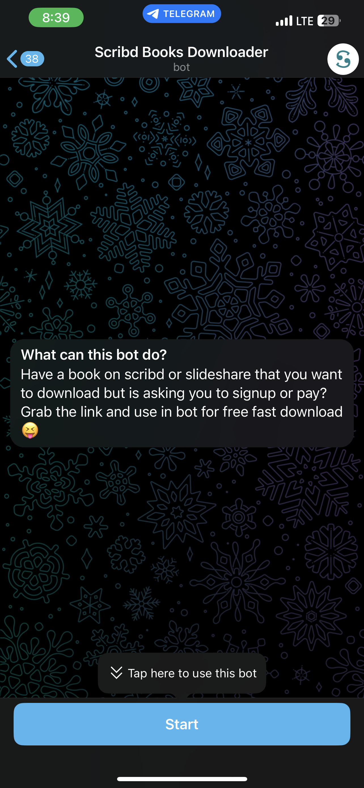
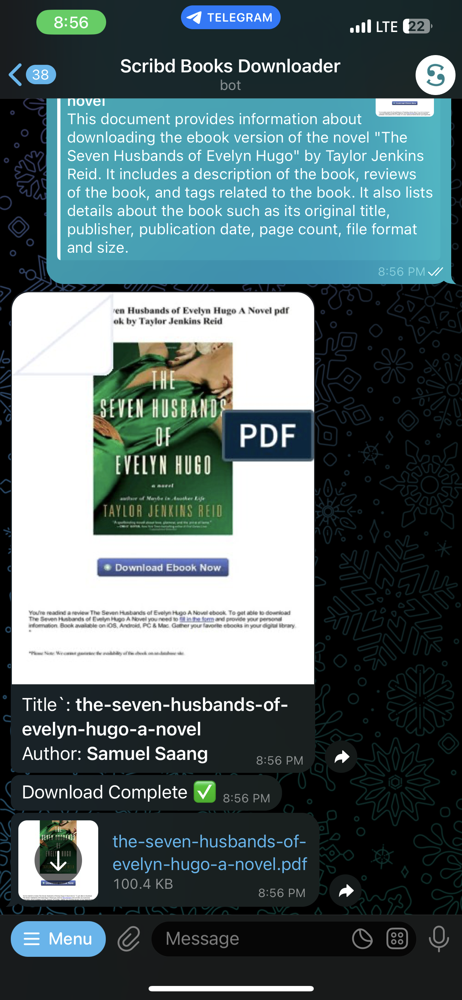
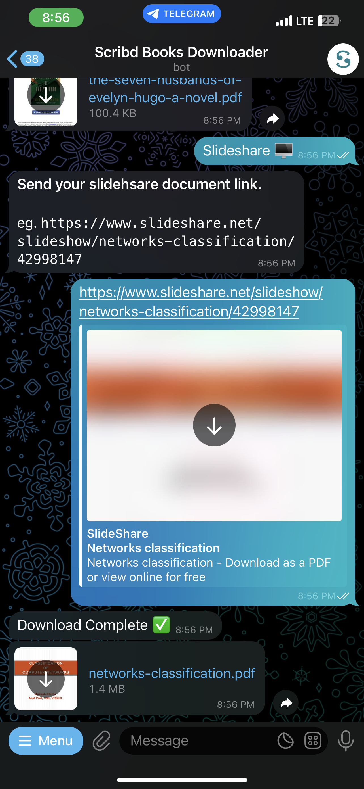

  <h1>SCRIBD & SLIDESHARE DOWNLOADER BOT 🤖</h1>
  
  
  
  

> This bot downloads documents from scribd and slideshare using the document link. Bot 👉 <a href='https://t.me/scribd_books_bot'>Telegram 🤖</a>
